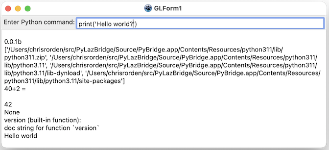

## Warning

**This is an experimental project, not yet ready for prime time.**

## About

[PythonBridge](https://github.com/genericptr/PythonBridge) is a bare-bones Python 3 API bridge for [Free Pascal](https://www.freepascal.org). However, the PythonBridge repository only includes a sample command line program. This PyLazBridge repository provides an example using a graphical user interface. This [Lazarus](https://www.lazarus-ide.org) project that can be natively compiled to Linux, macOS or Windows This allows a native executable to run Python scripts, which is useful for automating tasks, demonstrating features, and identifying bugs.

## Compiling a console application

You can use [Free Pascal](https://www.freepascal.org/) to build the sample terminal program. The source code is named `console.pas`, and it requires the units in the folder `PythonBridge`. So you can compile with the command:

```
fpc console.pas -Fu"./PythonBridge"
```

## Compiling a graphical user interface program

The graphical user interface application uses the [Lazarus](https://www.lazarus-ide.org) integrated development environment (which includes Free Pascal). Lazarus can build applications for Windows, Linux and MacOS using the native widget set (Cocoa for macOS, Windows API for Windows, and GTK2, GTK3 or QT5 for Linux). You can use the Lazarus graphic interface to build the program, or use the`lazbuild` command line:

```
lazbuild -B gui.lpi
```

The user interface is shown in the image below. You can type a Python command into the command line at the top of the screen, when you press the `return` (`Enter`) key, Python will execute the command. For example, the command `print('Hello world')` causes the phrase to appear in the output at the lower half of the screen.



## Pascal Details

The basic details for [embedding Python in an executable are described online](https://docs.python.org/3/extending/embedding.html). However, linking the libraries can be [challenging](https://stackoverflow.com/questions/27672572/embedding-python-in-c-linking-fails-with-undefined-reference-to-py-initialize).

To pass Python commands to our Pascal program we will use the  [PyArg_ParseTuple()](https://docs.python.org/3/c-api/arg.html) function. Lets consider one function, `Azimuth()` where we want the Python script to control some property of our native Pascal executable. We first define this method: we include the `name` (e.g. `Azimuth`), a callback (the Pascal function we will invoke), and the `help` [docstring](https://www.python.org/dev/peps/pep-0257/).

```
  methods: array[0..2] of TPythonBridgeMethod = (
    (name: 'azimuth'; callback: @PyAZIMUTH; help: 'azimuth(f): set azimuth of camera'),
...
```

Next, we write the Pascal callback function. We use [c.PyArg_ParseTuple()](https://docs.python.org/3/c-api/arg.html#c.PyArg_ParseTuple) to convert the Python inputs (e.g. `f:` indicates the function requires a single floating point value) to our Pascal value (`fl`). Any Python function expects a return value: we will set this to true if the PyArg_ParseTuple() succeeds. Finally, we can use pure Pascal to do whatever we want with the value `fl`.

```
function PyAZIMUTH(Self, Args : PPyObject): PPyObject; cdecl;
var
  fl: single;
  ret: integer;
begin
  ret := PyArg_ParseTuple(Args, 'f:azimuth', @fl);
  result := PyBool_FromLong(ret);
  if (ret = 0) then exit();
  writeln('Azimuth set to ' + floattostr(fl));
end;
```

When the program launches, all in-built Pascal methods are loaded, here we call this module `gl`: 

```
PythonAddModule('gl', @methods, length(methods));
```

Subsequently, any Python script can invoke our functions. Here is a minimal Python script:

```
import gl
gl.azimuth(42)
```

## Python Details

Python provides good [documentation regarding embedding Python into other programming languages.](https://docs.python.org/3/extending/embedding.html). The default build for Unix (Linux, macOS) links static libraries to the executable. You can alternatively provide the `PYTHON_DYNAMIC` compiler directive to link to a dynamic library (e.g. Linux `.so`, macOS `.dylib`, Windows `.dll`). You will need to edit the `Main.pas` file to specify the library name.

With Unix (Linux and macOS), we can statically link the Python interpretter into the exexcutable file. However, Python still requires its standard libraries. In our example programs, we provide these in a Resources folder.

For Windows we must include a separate [dynamic link library (DLL)](https://docs.python.org/3/faq/windows.html#how-can-i-embed-python-into-a-windows-application). The Windows releases include a [Windows x86-64 embeddable zip file](https://www.python.org/downloads/windows/) that includes the standard library as a single zip file.

This repository includes pre-compiled versions of Python for Linux, Windows and macOS. You should be aware that different versions of Linux use different libraries that are not forward compatible. Therefore, if you build your own copy of Python on one Linux distribution, it may not work on another. To resolve this, the provided library was built with a [Holy Build Box](https://github.com/phusion/holy-build-box) that should be compatible with any recent version of Linux. If you want to build your own statically linkable version of Python, you can get the [Python source code](https://www.python.org/downloads/release) and compile it with the commands:

```
 - Compile with `./configure --disable-shared; make`
```

## Links and Alternatives

 - [Python-for-Lazarus](https://github.com/Alexey-T/Python-for-Lazarus) uses an existing Python installation, rather than linking static code. This only supports Python 3.* versions.
 - [Python27-for-Lazarus](https://github.com/neurolabusc/Python27-for-Lazarus) is a fork of Python-for-Lazarus, which is able to use either Python 2.7 as well as more modern versions of Python.

